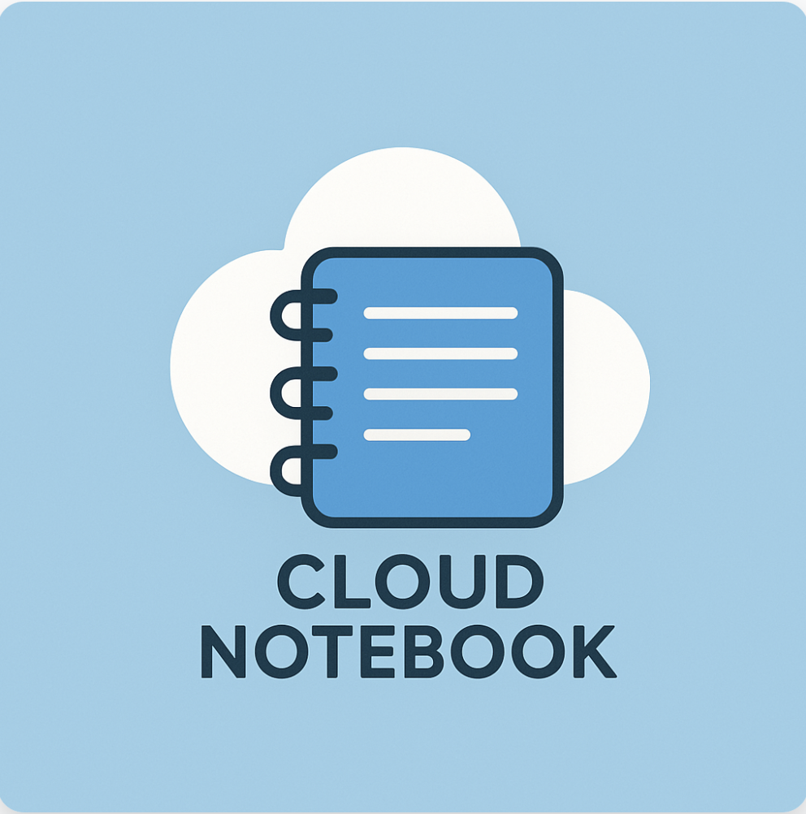
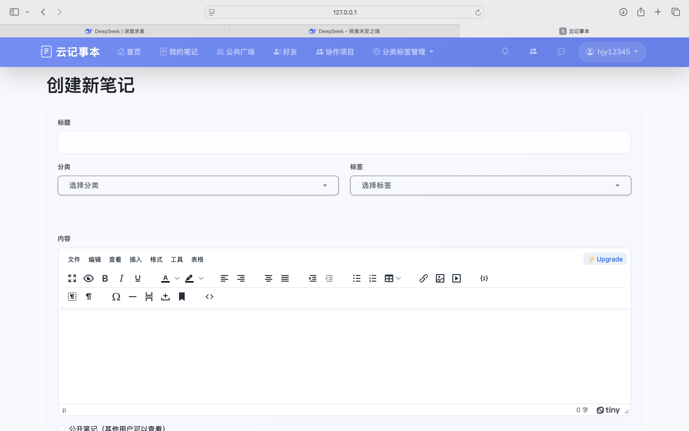
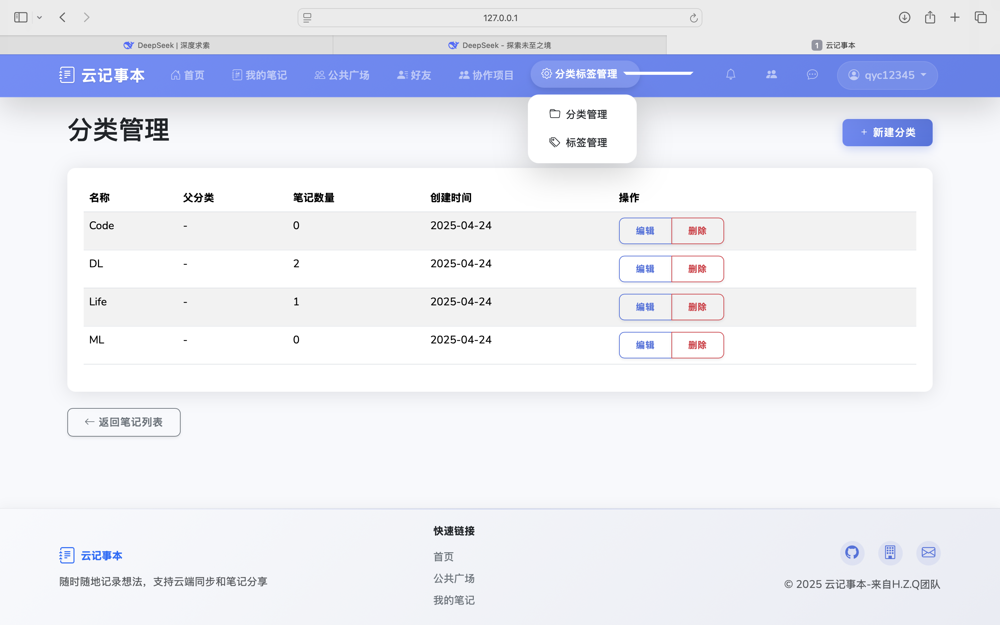
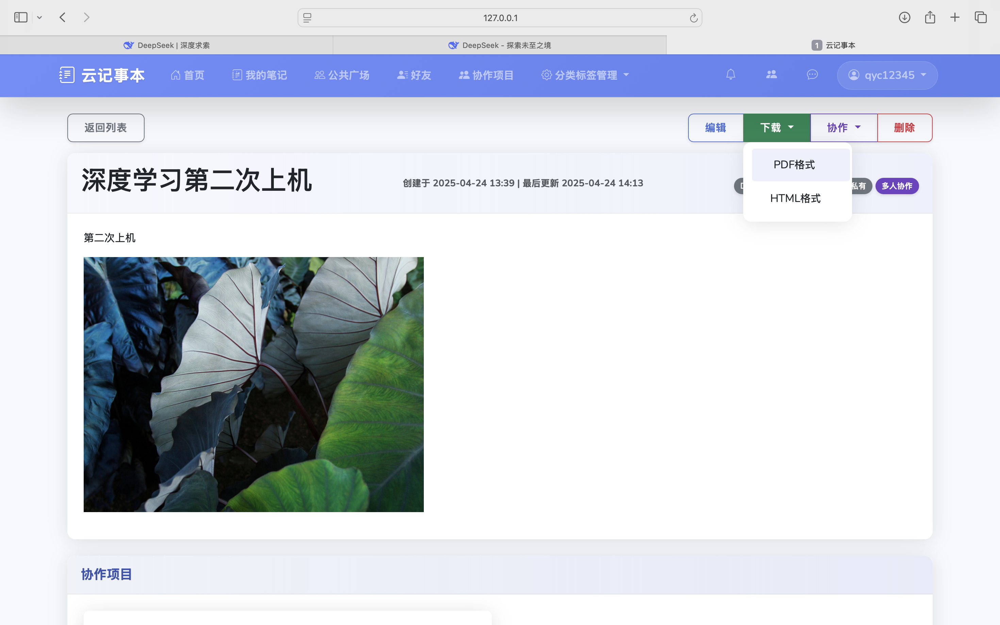

  

<h1 align="center">🚀 Cloud NotePad - 云端筑梦，笔尖生花 ✍️</h1>

  <strong>这不仅仅是一个记事本。</strong>  
  它是您思想的无限画布，是团队协作的数字枢纽，是连接灵感与现实的云端桥梁。  
  <strong>欢迎来到 Cloud NotePad 的世界！</strong>

  

  
  
  

---

## 🌟 核心亮点：不止记录，更是创造与连接 🌟

Cloud NotePad 精心打磨每一个细节，旨在为您提供极致的笔记体验和强大的协作能力。

### 🎨 1.【挥洒自如】沉浸式富文本编辑

告别枯燥的纯文本，让您的笔记活起来！我们内置了功能强大的富文本编辑器，让排版成为一种享受。

*   **视觉化编辑：** 加粗、斜体、标题、引用、代码块... 所见即所得。
*   **图文混排：** 轻松拖拽或上传图片，让内容表达更直观。
*   **结构化列表：** 有序、无序、任务列表，清晰梳理思路。
*   **链接嵌入：** 方便地插入和管理超链接。

  

### 🗂️ 2.【井井有条】强大的分类与标签系统

信息爆炸时代，高效整理是关键。Cloud NotePad 提供灵活的组织工具，让您的知识库清晰明了。

*   **多级分类：** 创建笔记本、文件夹，构建您的个性化知识体系。
*   **智能标签：** 为笔记添加多个标签，实现跨分类的快速检索。
*   **闪电搜索：** 全文搜索，瞬间定位您需要的任何信息。

  
   

### ☁️ 3.【云端守护】数据安全，永不丢失

您的每一个想法都弥足珍贵。Cloud NotePad 提供可靠的云存储，让您安心创作。

*   **实时同步：** 笔记自动保存至云端，多设备无缝访问。
*   **安全保障：** 先进的加密技术，守护您的数据隐私。
*   **版本回溯（可选）：** （若实现）轻松找回历史版本，告别误操作烦恼。

  
   
  <i>（👆 概念示意 GIF）</i>

### 💾 4.【本地掌控】自由导出，格式随心

数据自由，尽在掌握。支持将您的笔记导出为通用格式，方便备份与分享。

*   **PDF 导出：** 保留精美排版，适合打印和正式文档。
*   **HTML 导出：** 网页格式，便于在浏览器查看或二次编辑。
*   **一键操作：** 简单快捷，轻松将重要内容备份到本地。

  

### 🧑‍🤝‍🧑 5.【连接你我】好友系统与即时通讯

Cloud NotePad 不仅是工具，更是社区。内置的好友系统，让沟通与分享更进一步。

*   **发现好友：** 轻松搜索并添加平台上的其他用户。
*   **即时聊天：** 与好友在线畅聊，讨论笔记，碰撞思想。

  <!-- 在线找一个代表“社交连接”或“聊天”的动画/GIF -->
  

### 🤝 6.【团队协作】共创共享，激发潜能

打破信息孤岛，实现高效协作。Cloud NotePad 提供强大的团队协作功能。

*   **协作空间：** 创建项目，邀请成员，共同维护多个笔记本。
*   **权限管理：** 精准控制“查看者”与“编辑者”权限。
*   **同步编辑（若实现）：** 多人实时（或近实时）编辑，信息保持同步。
*   **协作动态：** 成员变动都可以实现，也可以选择退出项目

  

### 🌐 7.【知识广场】分享发现，思想碰撞

您的精彩见解，值得被更多人看见。在公共广场分享知识，发现灵感。

*   **一键公开：** 自主选择笔记是否公开，分享您的创作。
*   **发现优质内容：** 浏览他人分享的笔记，拓宽视野。
*   **点赞评论：** 与作者和其他读者互动，交流想法。
*   **热门推荐（扩展）：** 发现社区中的热门和精华笔记。

  

### 🔔 8.【智能提醒】重要信息，不再错过

在信息洪流中保持专注。完善的通知系统，让您及时掌握所有动态。

*   **分类提醒：** 好友申请、协作邀请、聊天消息、互动通知，清晰分类。
*   **实时推送（若实现）：** 重要信息第一时间送达。
*   **通知中心：** 统一管理所有未读消息，高效处理。

  

---

## 🚀 即刻启程，体验 Cloud NotePad！

准备好开启全新的笔记与协作之旅了吗？

*   **[🌟 Star 我们，给予支持！](https://github.com/JiaYiByte101/Cloud_Notepad)**
*   **[💻 查看源码 & 参与贡献](https://github.com/JiaYiByte101/Cloud_Notepad)**

> **提示:** 如果您想在本地运行 Cloud NotePad，获取源码后务必进行本地的调整。

---

## 🙏 致谢

Cloud NotePad 的灵感来源于对更高效知识管理和团队协作的追求。感谢开源社区以及所有为本项目提供支持的朋友！

**主要贡献者:**

---

## 📜 开源许可

本项目基于**MIT License**开源。

---

  ✨ <strong>Cloud NotePad - 记录思考，连接未来。</strong> ✨

